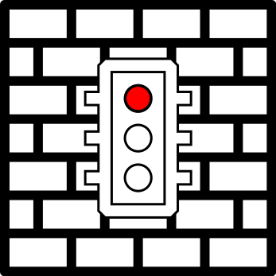

<p align="center">
  
</p>

# TrafficJam
<p align="center"><b>A Firewall for Docker</b></p>

[](https://github.com/kaysond/trafficjam/actions/workflows/build-latest.yml) [](https://github.com/kaysond/trafficjam/actions/workflows/build-nightly.yml) [](https://github.com/kaysond/trafficjam/actions/workflows/ci.yml)

## Setup
`docker-compose.yml`:
```
services:
  trafficjam:
    container_name: trafficjam
    image: kaysond/trafficjam
    cap_add:
      - NET_ADMIN
    network_mode: host
    volumes:
     - /var/run/docker.sock:/var/run/docker.sock
    environment:
      TZ: America/Los_Angeles
```

## Firewall Configuration
TrafficJam is configured through docker labels. Labels can be applied to networks or containers.

### Networks
The following labels can only be applied to networks:
* **`trafficjam.enable`:** must be set to "true" for TrafficJam to create rules on the network. Any other value is considered "false".
* **`trafficjam.default_policy`:** must be "block" or "allow" (default: "block")

### Networks or Containers
Labels that define firewall rules can be applied to networks or containers. Labels applied to a network block or allow traffic to or from the <u>entire network subnet</u>. Labels applied to a container do so for the container only. They take the form:

`trafficjam.[network name.]rule<#>.(allow | block).(to | from).(filter | ip | network): [!][target][:port][/<protocol>]`

---
## FORMAT 1
---

##### `[network name]`
Labels applied to *containers* must specify which network the rule is for, and the container must be attached to that network

##### `rule<#>`
Ordering of the rule (applied per-*network*)

---
## FORMAT 2
---

* **`[network name]`:** labels applied to *containers* must specify which network the rule is for, and the container must be attached to that network
* **`rule<#>`:** ordering of the rule (applied per-*network*)
* **`(allow | block)`**: specifies whether matching traffic showed be allowed or blocked
* **`(to | from)`**: specifies whether the target (e.g. the value of the label) is the traffic destination (`to`) or source (`from`)
* **`(filter | network | ip)`:** defines the type of the target specified as the label value
  * **`filter`:** a string passed to [`docker container ls --filter`](https://docs.docker.com/reference/cli/docker/container/ls/#filter) (TrafficJam will automatically filter to only match containers on the same docker network)
  * **`ip`:** an ip address (`192.168.1.1`), range (`192.168.1.1-192.168.1.255`), CIDR range (`192.168.1.0/24`), or comma seperated list of any combination of these (`192.168.1.0/24,10.0.0.1,172.16.0.0/12`)
  * **`network`:** the subnet of the docker network (no `target` value is necessary for this target type)
* **Rule Targets (`[!][target][:port][/<protocol>]`):**
  * **`[!]`:** if the rule target starts with `!`, it is negated (applies to `ip` and `network` only)
  * **`[target]`:** the value of the target as specified above
  * **`[:port]`**: a port (`:80`) or port range (`:1024-65535`) for the target
  * **`[/<protocol>]`**: a protocol for the target (e.g. `/tcp`, `/udp`, `/icmp`)

#### Rule Examples
* `trafficjam.rule0.allow.to.ip: !192.168.0.0/16,172.16.0.0/12,10.0.0.0/8`: allows all traffic to non-RFC1918 addresses (i.e. allows internet access) from the network
* `trafficjam.rule0.block.to.network:`: blocks all traffic between containers on the same network (useful if the `default_policy` is "allow")
* `trafficjam.my_network.rule0.allow.to.network:`: allows traffic from the container to any other container on the network
* trafficjam.allow.from.filter

**Note:** TrafficJam automatically allows response traffic

## Dependencies
* nftables (1.1.3+)

## Clearing Rules
`trafficjam` can be run with the `--clear` argument to remove all rules that have been set. Note that the host docker socket must be mounted within the container. The rules can also be cleared by sending the `SIGUSR1` signal to the container. This will cause `trafficjam` to exit.

Examples:
* `docker run --volume "/var/run/docker.sock:/var/run/docker.sock" --cap-add NET_ADMIN --network host kaysond/trafficjam --clear`
* `docker kill --signal SIGUSR1 trafficjam`


### Docker Socket Proxying
The attack surface of trafficjam is very low because it is not exposed to any networks; it's nearly the same as running the bash scripts outside of docker. For this reason, bind mounting the docker socket does not pose a significant security concern. It is possible to use a docker socket proxy nonetheless with some special setup. First, the proxy image must have a static IP address. Second, the environment variable `DOCKER_HOST` must be set on **trafficjam** to `tcp://<proxy ip address>:2375`. For more details, see #15.

**Notes:** 
Docker Swarm services tag images with a sha256 hash to guarantee that every node runs the exact same container (since tags are mutable). When using the `ancestor` tag, ensure that the appropriate hash is included as shown in the examples.

`trafficjam` requires the `NET_ADMIN` Linux capability in order to manipulate `iptables` rules. For Docker Swarm setups, `SYS_ADMIN` is also required in order to enter namespaces, though the setting of container capabilities is automatically handled by the `trafficjam` swarm daemon.