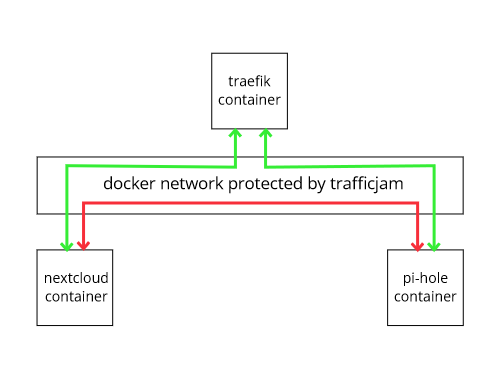

# TrafficJam (Beta)
A Docker firewall for your reverse proxy network

[](https://github.com/kaysond/trafficjam/actipns/workflows/build-latest.yml) [](https://github.com/kaysond/trafficjam/actipns/workflows/ci-latest.yml) [](https://github.com/kaysond/trafficjam/actipns/workflows/build-nightly.yml) [](https://github.com/kaysond/trafficjam/actipns/workflows/ci-nightly.yml)

## Threat Model
**Why do you need something like TrafficJam?** Reverse proxies are often used to authenticate external access to internal services, providing benefits such as centralized user management, access control, 2FA and SSO. In a typical Docker setup, multiple services are connected to the reverse proxy via a single network. If a user authenticates to one service and is able to compromise that service (such as by using [this Pi-Hole vulnerability](https://natedotred.wordpress.com/2020/03/28/cve-2020-8816-pi-hole-remote-code-execution/ "this Pi-Hole vulnerability")), that user will gain access to the entire network *behind* the reverse proxy, and can access every service on the network whether they would normally have permission or not.

Potential solutions include:
* Use each service's own authentication
  * Not all services provide 2FA :(
  * Many services do not support centralized user management (LDAP)  :(
  * Many services do not support SSO  :(
* Have each service on a unique network
  * Reverse proxy network connections must be updated every time a service is added or removed :(
  * Manually configuring every service and reverse proxy entry is painful and error-prone even with tools like Ansible :(
* Use a reverse proxy with auto-discovery and a firewall to isolate services
  * Enables 2FA, LDAP, ACL, SSO, etc. regardless of service support :)
  * Routes are automatically discovered by the proxy without manual configuration :)
  * Every service only needs a connection to one network :)

## What TrafficJam Does
TrafficJam allows you to safely and easily connect all of your backend containers to your reverse proxy using a single docker network by preventing the backend containers from communicating with each other.



## How TrafficJam Works
TrafficJam works by adding some firewall (`iptables`) rules to the docker network you specify. First, it blocks all traffic on the network. Then it adds a rule that only allows traffic to/from the container(s) you specify in the whitelist. It continually monitors the docker network to make sure the rules stay up to date as you add or remove containers.

## Setup Examples

### Vanilla Docker
`docker-cli`:
```
docker run -d --name trafficjam --cap-add NET_ADMIN --network host \
  -v "/var/run/docker.sock:/var/run/docker.sock" \
  --env NETWORK=traefik_public \
  --env WHITELIST_FILTER="ancestor=traefik:latest" \
  --env TZ="America/Los_Angeles"
  kaysond/trafficjam
```

`docker-compose.yml`:
```
version: '3.8'
services:
  trafficjam:
    container_name: trafficjam
    image: kaysond/trafficjam
  cap_add:
      - NET_ADMIN
    network_mode: host
    volumes:
     - /var/run/docker.sock:/var/run/docker.sock
    environment:
      NETWORK: traefik_public
      WHITELIST_FILTER: ancestor=traefik:latest
      TZ: America/Los_Angeles

  traefik:
    container_name: traefik
    image: traefik:latest
    networks:
      traefik_public:

  whoami:
    container_name: whoami
    image: traefik/whoami
    networks:
      traefik_public:

networks:
  traefik_public:
```

### Docker Swarm
`docker-cli`:
```
docker service create \
  --name trafficjam \
  --mount type=bind,source=/var/run/docker.sock,destination=/var/run/docker.sock \
  --env NETWORK=traefik_public \
  --env WHITELIST_FILTER=ancestor=traefik:v2.3.7@sha256:0aca29bb8e51aa69569b15b8b7f08328e6957cbec201dd532304b3329e5a82a9 \
  --env SWARM_DAEMON=true \
  --env TZ=America/Los_Angeles \
  --replicas 1 \
  --constraint node.role==manager \
  kaysond/trafficjam
```

`docker-compose.yml`:
```
version: '3.8'

services:
  trafficjam:
    image: trafficjam
    volumes:
     - /var/run/docker.sock:/var/run/docker.sock
    environment:
      NETWORK: traefik_network
      WHITELIST_FILTER: ancestor=traefik:v2.3.7@sha256:0aca29bb8e51aa69569b15b8b7f08328e6957cbec201dd532304b3329e5a82a9
      SWARM_DAEMON: "true"
      TZ: America/Los_Angeles
    deploy:
      replicas: 1
      placement:
        constraints: ['node.role==manager']
```

**Note:** Docker Swarm services tag images with a sha256 hash to guarantee that every node runs the exact same container (since tags are mutable). When using the `ancestor` tag, ensure that the appropriate hash is included as shown in the examples.

## Configuration
TrafficJam is configured via several environment variables:
* **NETWORK** - The name of the Docker network this instance of TrafficJam should manage (multiple instances can be run for different networks)
* **WHITELIST_FILTER** - A Docker `--filter` parameter that designates which containers should be permitted to openly access the network. See [Docker Docs - filtering](https://docs.docker.com/engine/reference/commandline/ps/#filtering)
* **TZ** - Timezone (for logging)
* **SWARM_DAEMON** - Setting this variable is required for swarm and activates a daemon that determines network load balancer IP addresses and properly configures the trafficjam service
* **SWARM_IMAGE** - The image the trafficjam swarm daemon should deploy (defaults to `kaysond/trafficjam`). The best practice is to pin this to a particular image hash (e.g. `kaysond/trafficjam:v1.0.0@sha256:8d41599fa564e058f7eb396016e229402730841fa43994124a8fb3a14f1a9122`)
* **POLL_INTERVAL** - How often TrafficJam checks Docker for changes
* **ALLOW_HOST_TRAFFIC** - Allow containers to initiate communication with the docker host, and thus any port-mapped containers. Most users do not need this setting enabled. (See [Technical Details](#technical-details) for more information).
* **DEBUG** - Setting this variable turns on debug logging

## Dependencies
* Linux with iptables whose version matches the iptables in TrafficJam (currently `1.8.4 (legacy)`)
* Docker >20.10.0

## Technical Details
TrafficJam limits traffic between containers by adding the necessary iptables rules on the host. When Docker Swarm is in use, TrafficJam acts as a daemon that spawns a global mode service so that the rules are added to the correct network namespace on each host. This daemon-service method is also required because Docker Swarm employs a separate load balancer on each node whose IP address must be permitted to communicate to the subnet. Since each node (even a manager) is only aware of its own load balancer's IP address, the daemon must start the service, collect the reported load balancer IP addresses of all nodes, then update the service.

First, TrafficJam queries the docker daemon to determine the specified network's subnet and the ID's of whitelisted containers. If Docker Swarm is in use, TrafficJam also determines the correct network namespace and load balancer IP on the host.

TrafficJam then adds its own chain in the `filter` table called `TRAFFICJAM`. It also adds a jump rule to the `DOCKER-USER` chain (or `FORWARD` for Docker Swarm) to jump to this chain: `iptables -t filter -I <chain> -j TRAFFICJAM`

Then, TrafficJam inserts several rules to the `TRAFFICJAM` chain in the `filter` table which are ultimately evaluated top to bottom:
1. Accept already-established traffic whose source and destination are the network subnet - `iptables -t filter -I TRAFFICJAM -s $SUBNET -d $SUBNET -m conntrack --ctstate RELATED,ESTABLISHED -j RETURN`
2. Accept traffic from whitelisted containers destined for the network subnet (this requires one rule per container) - `iptables -t filter -I TRAFFICJAM -s "$IP" -d "$SUBNET" -j RETURN`
3. (Docker Swarm only) Accept traffic from all load balancers (this requires one rule per node) - `iptables -t filter -I TRAFFICJAM -s "$LOAD_BALANCER_IP" -d "$SUBNET" -j RETURN`
4. Drop traffic whose source and destination are the network subnet - `iptables -t filter -I TRAFFICJAM -s "$SUBNET" -d "$SUBNET" -j DROP`
(Note that the script inserts the rules in reverse order since they're inserted to the top of the chain)

Thus all traffic on the relevant subnet hits the `DROP` on Rule 4 except traffic initiated by the whitelisted containers (usually the reverse proxy).

This alone is not sufficient to prevent inter-container communication, however. If a container has a port mapped to the host, other containers are still able to access it via the host ip address and the mapped port. This is because Rule 4 above only drops traffic within the subnet, not traffic to the outside, to allow containers to have internet access.

This is blocked by another chain and set of rules. First, TrafficJam adds another chain in the `filter` table: `TRAFFICJAM_INPUT`. Then it adds a jump rule to the `INPUT` chain: `iptables -t filter -I input -j TRAFFICJAM_INPUT`. The `INPUT` chain is used here because the incoming packet is destined for an IP address assigned to the host and does not need to be forwarded.

TrafficJam adds two rules to this new chain, again shown in final order:
1. Accept already-established traffic whose source is the network subnet - `iptables -t filter -I TRAFFICJAM_INPUT -s $SUBNET -m conntrack --ctstate RELATED,ESTABLISHED -j RETURN`
2. Drop traffic whose source is the network subnet - `iptables -t filter -I TRAFFICJAM_INPUT -s "$SUBNET" -j DROP`